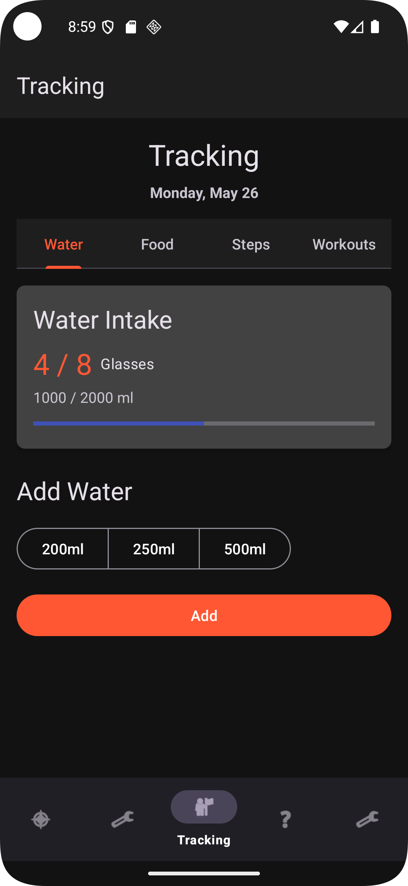

# GymPal - Your Fitness Companion App


## Overview

GymPal is a comprehensive fitness tracking application designed to help users achieve their fitness goals. With features like workout tracking, nutrition logging, fitness calculators, and an AI-powered fitness coach, GymPal serves as your all-in-one companion for your fitness journey.

## Features

### Dashboard
- At-a-glance view of daily fitness metrics
- Progress tracking for steps, water intake, calories, and workouts
- Quick actions for common tasks

### Fitness Tracking
- Track daily water intake
- Record workout sessions
- Monitor step counts
- Log nutrition and calorie intake

### Fitness Calculators
- BMI (Body Mass Index) Calculator
- BMR (Basal Metabolic Rate) Calculator
- Protein Needs Calculator

### AI Fitness Coach
- Get personalized fitness advice
- Ask questions about workouts, nutrition, and health
- Receive markdown-formatted responses for better readability
- Quick prompts for common fitness inquiries

### User Profile
- Personalized user information
- Customizable fitness goals
- Track progress over time

## Architecture

GymPal is built using modern Android development practices:

- **MVVM Architecture**: Separation of UI, business logic, and data
- **Repository Pattern**: Single source of truth for data operations
- **Dependency Injection**: Using Hilt for clean, modular code
- **Room Database**: Local storage for offline capabilities
- **DataStore**: For lightweight user preferences
- **Kotlin Coroutines & Flow**: For asynchronous operations
- **Jetpack Navigation**: For fragment-based navigation

## Technologies Used

- **Kotlin**: Primary programming language
- **Android Jetpack Components**:
  - ViewModel
  - LiveData
  - Navigation
  - Room
  - DataStore
- **Material Design Components**: For a modern UI
- **Hilt**: For dependency injection
- **Markwon**: For markdown rendering
- **Google Gemini AI API**: For the AI fitness coach
- **Kotlin Coroutines & Flow**: For asynchronous operations

## Getting Started

## Dashboard

## Tracking


## Calculators


## AI Coach

## User Profile


### Prerequisites
- Android Studio Electric Eel (2022.1.1) or newer
- Minimum SDK: Android 30 (Android 11)
- Target SDK: Android 34 (Android 14)
- Gemini AI API key (for AI coach functionality)

### Setup
1. Clone the repository:
   ```
   git clone https://github.com/sbeving/gympal.git
   ```

2. Open the project in Android Studio.

3. Get an API key from [Google AI Studio](https://makersuite.google.com/) for Gemini AI model access.

4. Create a `secrets.properties` file in the project root with:
   ```
   GEMINI_API_KEY=your_api_key_here
   ```

5. Build and run the application on an emulator or physical device.

## Screenshots

[Add screenshots here showcasing different parts of the app]

## Future Enhancements

- Integration with fitness wearables
- Social features to connect with friends
- Customizable workout plans
- Barcode scanner for food tracking
- Exercise library with video demonstrations

## Contributing

Contributions are welcome! Please feel free to submit a Pull Request.

## License

This project is licensed under the MIT License - see the [LICENSE](LICENSE) file for details.

## Acknowledgments
- Special thanks to the Mobile Dev Professor for guidance and support @hajerGhodhbani
- Google Gemini AI for powering the fitness coach
- [Markwon](https://github.com/noties/Markwon) for markdown rendering
- Material Design for UI components
